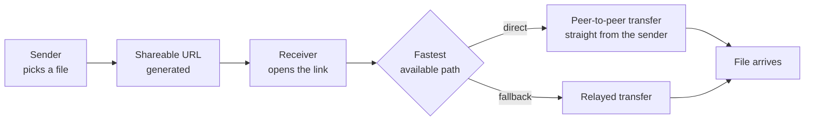

# GimmeURL

Turn a file on your computer into a URL. GimmeURL is a hybrid file-transfer app: you pick a file, it gives you a link, and whoever opens the link downloads the file directly from you over the fastest path available.

Sending a large file to one person is still absurdly clumsy in 2026 — upload to a cloud drive, wait, set permissions, send link, delete later. GimmeURL skips the middle: the file never needs to be uploaded anywhere, because the sender *is* the server for the duration of the transfer.

## How it works



"Hybrid" is the operative word: when a direct peer-to-peer connection is possible, the bytes travel straight between the two machines; when the network topology forbids it, the transfer falls back to a relayed path so the link still works. The receiver needs nothing but a browser.

## Features

- Share a local file as a plain URL — no account, no upload-and-wait
- Direct sender-to-receiver transfer when the network allows it
- Automatic fallback so links work even behind awkward NATs
- The link dies when you stop sharing; nothing lingers in a cloud bucket

## Running it

GimmeURL is a Tauri 2 desktop app — the sender runs it natively, the receiver needs only a browser. Requires the Rust toolchain and Node.

```bash
git clone https://github.com/aryansrao/gimmeurl
cd gimmeurl
npm install
npm run dev      # tauri dev
npm run build    # production bundle
```

Related repo: [gimmeurl-signal](https://github.com/aryansrao/gimmeurl-signal) — the signalling component used for connection setup.

## Honest limitations

- For a direct transfer the sender's tab has to stay open — you are the server
- Very large files are bounded by browser memory handling and connection stability
- A relayed fallback is slower than a direct path by nature

## Stack

Tauri 2 · Rust · JavaScript · peer-to-peer transfer with relay fallback

---

Built by [Aryan S Rao](https://github.com/aryansrao). GPL-3.0. Issues and pull requests are welcome.
